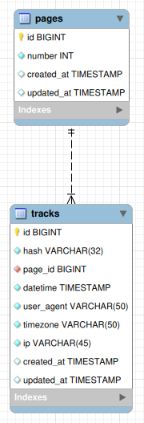

# Track System - README

## Overview
This project is a tracking system that captures user access information, including date and time of access, user agent, IP address, and page number. The system includes a `TrackController` with `index` and `store` methods to fetch and store tracking data, respectively.

## Components and Usage

### 1. **Controller - `TrackController`**
   - **`index(TrackIndexFormRequest $request)`**: Fetches tracking records based on date filters (start and end dates). 
   - **`store(TrackStoreFormRequest $request)`**: Stores a new tracking record if the user session is unique.

#### Usage
- **`index` Method**:
  - Sends a `GET` request with optional `start_date` and `end_date` parameters to fetch records in a specific range.
- **`store` Method**:
  - Sends a `POST` request with `date_time`, `user_agent`, `timezone`, `ip`, and `page_number` to store a new tracking record.

### 2. **Form Requests**
   - **`TrackIndexFormRequest`**: Validates the `index` request to ensure that `start_date` is required and `end_date` is required.
   - **`TrackStoreFormRequest`**: Validates the `store` request fields such as `date_time`, `user_agent`, `timezone`, `ip`, and `page_number`.

### 3. **Data Transfer Objects (DTOs)**
   - **`TrackIndexDto`**: Used in the `index` method to transfer the `start_date` and `end_date` data.
   - **`TrackStoreDto`**: Used in the `store` method to encapsulate tracking data, such as `date_time`, `user_agent`, `timezone`, `page_number`, and `ip`.

#### Usage
- **`TrackIndexDto`** and **`TrackStoreDto`** are instantiated within the controller methods and passed to their respective use cases to handle business logic.

### 4. **Use Cases**
   - **`TrackIndexUseCase`**: Retrieves tracking records using the `TrackIndexDto`.
   - **`TrackStoreUseCase`**: Stores tracking data only if it doesn’t already exist based on a unique hash.

### 5. **Entity**
   - **`TrackEntity`**: Encapsulates tracking data with attributes for `dateTime`, `userAgent`, `timezone`, `pageNumber`, and `ip`. It also provides:
     - **`getHash()`**: Returns a unique hash combining `ip`, `timezone`, `userAgent`, and `pageNumber`.
     - **`toArray()`**: Converts the entity to an array format.

### 6. **Repository Pattern**
   - **`TrackRepositoryInterface`**: Defines the methods for saving, finding, and retrieving tracking records.
   - **`TrackRepository`**: Concrete repository class that delegates database operations to an underlying repository implementation.
   - **`TrackEloquent`**: Implements the `TrackRepositoryInterface` using Eloquent ORM, handling methods like `findByHash`, `save`, and `getRecords`.


#### Usage
- **`TrackEntity`**: Created in the `TrackStoreUseCase` with the `TrackStoreDto` data and used for persistence operations in the repository.

## Routes

   - http://localhost:8000/page/{number} - View just a page to track user data, {number can be any integer, bigger or equal to 0}.
   - http://localhost:8000/records - View to show all users tracked data, filtering by date and hour on that given period.

## Database
   - 

## Setup

   - On your .env set your database config

   ```
      DB_CONNECTION=mysql
      DB_HOST=127.0.0.1
      DB_PORT=3306
      DB_DATABASE=records
      DB_USERNAME=root
      DB_PASSWORD=rootpassword
   ```

   - Execute
   ```
      composer install
      php artisan migrate
      php artisan serve
   ```
